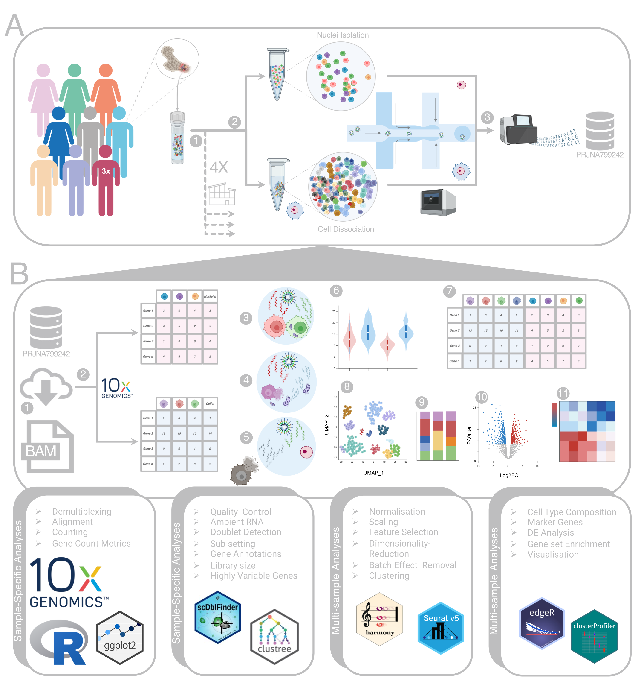

<<<<<<< HEAD
## **Title**
Comparative Analysis of Single-Nucleus and Single-Cell RNA Sequencing in Human Bone Marrow Mononuclear Cells: Methodological Insights and Trade-offs


## 🔬 **Overview**  
Bone marrow mononuclear cells (BMMCs) are a diverse population of hematopoietic progenitors and mature immune cells that sustain hematopoiesis and coordinate immune responses. The bone marrow is not only the primary site of blood cell production but also a key niche for various disorders, including blood cancers. Recent advances in scRNA-seq and snRNA-seq have significantly improved our understanding of cellular composition and molecular dynamics within this complex microenvironment.

However, the choice between these two approaches is influenced by study design, sample type, and preservation conditions. Differences in library preparation and transcript capture efficiency can introduce systematic biases, making it important to account for method-specific features during analysis.

Study Focus

In this work, we performed a comparative analysis of matched scRNA-seq and snRNA-seq datasets from 11 healthy donor BMMC samples, all generated using the 10x Genomics platform. We evaluated:

Method-specific biases across multiple quality metrics

Differences in cell type proportions and transcriptomic signatures

The feasibility and limitations of integrative analysis

Key Findings

Both scRNA-seq and snRNA-seq reliably captured all major BMMC cell types, despite differences in library complexity.

Systematic gene length biases exist between the two methods, which can complicate direct integration of datasets.

Understanding method-specific advantages and limitations is crucial for selecting the optimal approach for specific biological questions.

Impact

This study provides a resource for researchers aiming to:

Choose the appropriate single-cell sequencing method based on sample type and research objectives

Perform method-aware analyses and interpretation of scRNA-seq and snRNA-seq data

## **Citation**  
Please cite [our paper](XXXX) if you use our data and/or scripts in your studies.

## 📂 **Dataset**  
For this study, we re-used a publicly available dataset of bone marrow mononuclear cells (BMMCs), originally generated for a multi-modal single-cell benchmarking study. In this dataset, biological samples from multiple healthy donors (aged 22–40) were processed across four different laboratories, where each sample was split into two parts, with one part subjected to transcriptomic profiling using 10x Multiome and the other using 10x CITE-seq. 
For the both scRNA and snRNA, 3' gene expression libraries were sequenced on an Illumina NextSeq 2000 platform using paired-end reads with the following parameters: Read 1 (28 cycles), Index 1 (10 cycles), Index 2 (10 cycles), and Read 2 (90 cycles). 
The targeted sequencing depth was approximately 20,000 reads per cell or nucleus.

## 📂 **Data Availability** 
Publicly available multiome datasets of healthy donors with GEO accession numbers: [GSE194122](https://www.ncbi.nlm.nih.gov/bioproject/PRJNA799242). For further information, please read and cite [A sandbox for prediction and integration of DNA, RNA, and proteins in single cells](https://datasets-benchmarks-proceedings.neurips.cc/paper/2021/hash/158f3069a435b314a80bdcb024f8e422-Abstract-round2.html).

## 🌟 **Conclusion**  
In this study, we did not assume complete agreement between the results, nor was our aim to determine which method is superior. Instead, we conducted a series of analyses and visualisations to compare the outputs from two widely used single-cell RNA sequencing approaches on BMMCs. 
Although our batch correction and cell type annotations demonstrate that integrating datasets from these methods is technically feasible, we do not recommend directly comparing gene expression between the two methodologies. This caution is based on observed methodological biases—such as differences in library size, number of detected genes, and gene length—that may obscure biologically meaningful signals. Furthermore, this study offers practical guidance to researchers specifically bioinformaticians by highlighting key considerations related to the inherent characteristics of 
data generated by each methodology, helping inform decisions during preprocessing and downstream analysis.
Finally, while both methods provide valuable information and have their own advantages and trade‑offs, the choice between them should be guided by a well‑defined study design that considers factors such as sample preservation method (fresh versus frozen), logistical constraints (e.g., timing), and study objectives (e.g., multimodal data). 

## 🗂️ **Repository Structure**
```
snRNA_vs_scRNA_comparison-main/
├── scripts/                          # Bioinformatics pipelines & analysis scripts
      └── sessioninfo                        # session information
├── Figures/                             # Processed data files (metadata, cell annotations)
├── results/                           # Final figures and tables
├── SupplementaryData/                 # Supplementary figures and tables
├── README.md                         # Project overview & instructions
└──environment.yml                   # Conda environment setup
└── LICENSE                           # License information
```


#### **Processing raw data**  
- Bash script to download public data: [00_01_01_Public_Data_Parallel_Download.sh](scripts/00_01_01_Public_Data_Parallel_Download.sh)  
- Bash script to convert BAM to FASTQ: [00_01_02_Public_Data_cellranger_bam_to_fastq.sh](scripts/00_01_02_Public_Data_cellranger_bam_to_fastq.sh)  
- Bash script to run Cellranger ARC:  
  - [--mkfastq (AML data)](scripts/00_02_01_cellranger_arc_mkfastq_25AML_ATAC_GEX.sh)  
  - [--count (Public data)](scripts/00_01_03_cellranger_arc_count_13_public_data_ATAC_GEX.sh)  
  - [--count (AML data)](scripts/00_01_03_cellranger_arc_count_13_public_data_ATAC_GEX.sh)  
  - [--aggr (Merging 38 samples)](scripts/00_02_03_cellranger_arc_aggr_38_AML_Public_ATAC_GEX.sh)

#### **Seurat Pipeline**  
##### ***Quality Control***
- Python script to subsample data: [01_01_Sub_sampeling_29_donors.ipynb](scripts/01_01_Sub_sampeling_29_donors.ipynb)  
- R Markdown script for creating Seurat object and removing background RNA: [01_02_PreProcessing_SoupX_Creating_Multiome_Sobj.Rmd](scripts/01_02_PreProcessing_SoupX_Creating_Multiome_Sobj.Rmd)

## 📌 DOI
This repository will be archived on xyz upon publication.

## 🎉 **Acknowledgements**  
- Thanks to [10x Genomics](https://www.10xgenomics.com/) for providing the Multiome platform.

## 📜 **License**  
This project is licensed under the MIT License - see the [LICENSE](LICENSE) file for details.
=======
# Utilities and Custom Scripts

This repository contains a collection of **personalised scripts and utilities** I developed for my reseach projects as a bioinformatician.  
Most scripts are tailored for **single-cell RNA-seq (scRNA-seq) analysis**, but some are general-purpose for data visualisation and file conversion.

## Features
- 🧬 **scRNA-seq analysis**: custom QC, clustering, mutation burden analysis, and integration with Seurat/Scanpy  
- 📊 **Visualisation**: helper scripts for UMAP/TSNE plots, violin plots, and publication-ready figures  
- 🔄 **File conversion**: BAM ↔ VCF, count matrix formatting, metadata restructuring  
- 🛠️ **General utilities**: data wrangling, parsing, and automation helpers  

## Example Usage
```bash
# Clone the repository
git clone https://github.com/<GhamsariReza>/<customized-scripts>.git
cd <customized-scripts>

# Example: mutation-expression association
python scRNAseq/mutation_expression.py --input data/matrix.mtx --meta metadata.csv --output results.csv

>>>>>>> 811cb3a06e6c48bbbd75c744afd55fba2d1167b0
